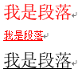
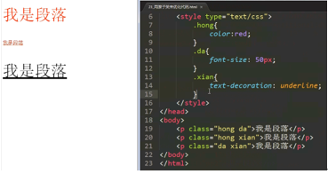
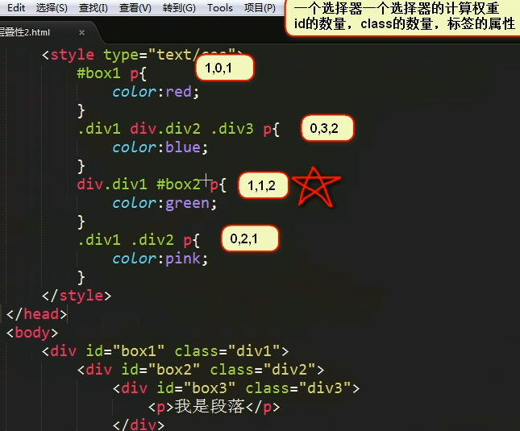
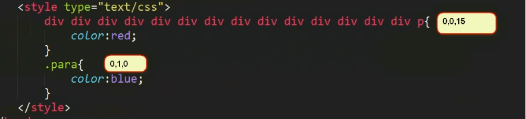
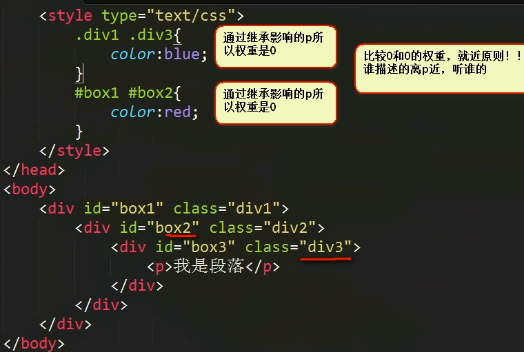
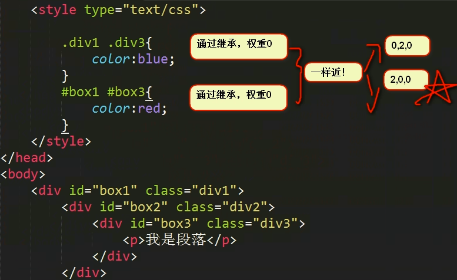
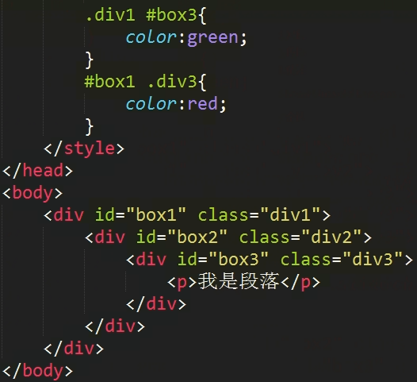

## CSS整体感知
### 简介
* 前端开发3层：

    |语言|分层|功能|
    |---|---|---|
    |HTML|结构层|语义、结构|
    |CSS|样式层|样式|
    |JS|行为层|交互、行为、动画|

* CSS的全程是cascading style sheet ， 层叠式样式表，“样式表”比较好理解，“层叠式”比较难理解。
* CSS的维护者也是w3c，最新版本是CSS3，但是浏览器没有那么的兼容，所以我们学习的是CSS2.1。

### 整体感知
* css分为两个部分，选择谁，设置什么样式
```html
    <style>
        h1{
        color:red;
        background-color: #fff;
        font-size: 20px;
        font-style: italic;
        }
        p{
        color:green;
        font-size: 50px;
        text-shadow: 2px 2px 2px blue;
        font-family: "SimSun";
        transform:rotate(20deg);
        width: 200px;
        }
    </style>
```
* h1、p就是选择器，表示选择那些html标签给他们加样式，就是说你要给谁加样式。然后大括号里面，就是k:v的结构，把所有的样式列出来，拥有的格式就列上，没有的格式就不写，有多少写多少
```
选择器{
    k:v;
    k:v;
}
```
* 所以我们必须要学习大量的css属性。。。

### 3 style标签---css的舞台
* css样式，可以写在style标签中，style标签需要写在<head>中`<style type="text/css"></style>`
    * style就是样式的意思，表示这个标签里面写的是样式
    * type是类型
    * text/css表示纯文本的css
   
### css 对于换行不敏感、缩进不敏感
写成一行，css代码尺寸小了，但是这是最后压缩干的事，还是一行一行写

### 分号
每个选择器的最后一项属性值可以没有分号，其他的都要有。一般情况下我们也会把最后

## 几个简单的属性
* 文字颜色
    * `color:red;`
    * color就是文字颜色的意思，后面的值首先使用英语描述，之后还能使用rgb、十六进制、描述颜色
    
* 背景颜色
    * `background-color:blue;`
    * background就是背景的意思，中间有一个短横和color连接,css中多个词组就是短横连接的。

* 字号
    * `font-size:40px;`
    * font就是字体，size就是尺寸，px就是英语pixel像素的意思

* 边框
    * `border:1px solid green;`
    * border就是边框的意思，他的取值十分有意思，是三个部分，使用空格隔开，顺序可以随意改变
        * 1px就是粗细
        * solid就是实线，虚线写成dashed
        * green就是颜色，可以任意设置

## 基本选择器
* 就是怎么选择元素

### 标签选择器
* 标签选择器是最简单的选择器，就是选择页面上所有的同种标签。要注意的是，选择的是页面上的所有标签，而不是一个
* 即使是层级很深的元素，也会被选择上
* body就是页面，如果要设置整个页面的背景颜色，就使用body的background-color属性即可
* 标签选择器有点不好用，一旦选择就全部选上，主要用于设置一些标签的默认情况（可以通过chrome来审查元素）
        
### id选择器
* 就是对于某一个（注意是一个）元素，进行特别的样式设定。就是给元素一个特别的名字，然后通过名字来选择他。
* 就是给元素加上id属性，然后在选择器开头使用#开
    ```html
    <style type="text/css">
        #pp{
            color:red;
        }
    </style>
    <p id="pp">this is a p</p>
    ```
* 首先，任何元素都可以设置id属性，合法的id属性是英语字母开头(大小写敏感)，可以有数字、下划线、短横。同一个页面中，id绝对不能相同，哪怕是不同元素，id也不能相同，我们必须保证，id在页面上是唯一的。
* 我们可以综合利用标签选择器、ID选择器一起做效果。比如，我们让所有p的字号都是20px，让其中某一个颜色是红色的. ***这就是层叠样式表的第一层含义，同一个标签可以有多个选择器选中它***

### 类选择器
* id有点不好用，因为是唯一的，如果页面上有两个、三个元素，想设置为同样的样式，id就无能为力了。
所以就是用类选择器，就是给某一类元素，设置相同的类名，然后通过这个类名来选择。
* class叫做类名。
    ```
    <style type="text/css">
        .warning{
            color:red;
        }
    </style>
    
    <p class="warning"></p>
    <p class="warning"></p>
    <p class="warning"></p>
    ```
* 命名上来说，类和id是一样的
* 多个标签携带同一个类名
    ```
    <p class="warning">我是段落</p>		
    <p class="warning">我是段落</p>
    <p>我是段落</p>
    <p>我是段落</p>
    <h3>我是一个h3</h3>
    <h3 class="warning">我是一个h3</h3>
    <p>我是段落</p>
    <p>我是段落</p>
    <h3>我是一个h3</h3>
    <h3 class="warning">我是一个h3</h3>
    ```
* 同一个标签也可以携带多个类名，使用空格隔开(两个类名都能选中这个标签)
    ```
        .warning{
            color:red;
        }
        .xian{
            text-decoration:underline;
        }
        
        <p class="warning xin">this is p</p>
    ```
### 原子类



* 类名的使用的时候，尽量用有语义的单词来表示：warning、important、ad、main。
* 不要用一些具体的单词：red、hong、left-part、right-part。

### id和class的选择问题
* 写页面到底用id还是class呢？答案非常肯定：class。哪怕页面上只有某一个要改样式，那么我尽量给这一个元素一个单独的class，也不给他id。
* 这是因为id是js常用的标签，如果你在css就把id用掉了，js程序就有耦合性的问题。
 
    
 

## 高级选择器
### 后代选择器
* 后代选择器使用空格表示
    ```html
    <div class="zhengzhi">
        <p>我是一些政治新闻</p>
        <p>我是一些政治新闻</p>
        <p>我是一些政治新闻</p>
        <p>我是一些政治新闻</p>
    </div>
    
    <style type="text/css">
            .zhengzhi p{
                color:blue;
            }
    </style>

    ```
* 择的是后代的元素，不一定是儿子，如果是孙子、曾孙子、重孙子……都行
* 可以多重描述祖先顺序，但是顺序必须真实存在：

### 交集选择器
* 选择即是p标签，同时又是haha类的元素
* p.haha 一般语法为  标签名.类名

### 并集选择器
* 逗号表示并集 “都”
```
<style type="text/css">
    p,div{
        color:red;
    }
</style>

等价于

p.haha{
    color:red;
}
div.xixi{
    color:red;
}
```

### 通配符 *
* 选择所有元素，用*
```
<style type="text/css">
    *{
        color:red;
    }
</style>
```

## 继承性和层叠性
### 继承性
* css规定，某一些属性，给某一个元素设置了，他的后代元素都能够同样拥有这个属性
    * 能够继承的属性
        1. color
        2. text-系列，比如text-decoration:none;
        3. font-系列，font-size:12px;
        4. line-系列，line-height:20px;
    * background和border不能够继承
* 继承的好处
    * 能够将一些基本的初始的设置写在body中，这样所有的元素都会默认拥有
    * 层叠式样式表，cascading的第二层含义，就是继承性

### 层叠性
* 层叠性就是处理冲突的能力
    * ```
        <p class="haha" id="para">我是段落</p>
        
        <style type="text/css"> 
            p{color:red;}
            #para{color:green;}
            .haha{color:blue;}
        </style>
      ```
    * 此时就是层叠性的用途，css有一套含严格的规则
* 选择器的权重问题：
    1. id的权重    (大于)
    2. 类的权重    (大于)
    3. 
    
* 例题一(比较复杂的权重计算)
    ```
    <head>
        <style type="text/css">
            #box1 p{
                color:red;
            }
            .div1 div.div2 .div3 p{
                color:blue;
            }
            div.div1 #box2 p{
                color:green;
            }
            .div1 .div2 p{
                color:pink;
            }
        </style>
    </head>
    <body>
        <div id="box1" class="div1">
            <div id="box2" class="div2">
                <div id="box3" class="div3">
                    <p>我是段落</p>
                </div>
            </div>
        </div>
    </body>
    ```
     

* 注意：就算是10个以上的标签选择器也抵不过一个类选择器
    * 
* 注意： 继承而来的属性，优先级是0，（也就是说，只有直接选中的标签，才能够计算权重，如果是继承而来的权重为0）

#### 层叠性计算总结
1. 如果都直接选中，权重相同，那么以style列表中后出现的选择器为准
2. 都是通过继承而来的呢： 就近原则，谁描述的近，听谁的。

    * 
    * 如果一样近，比较标签权重，谁权重大听谁的
    * 如果权重也一样，以后面出现的为准

* 例题二(一样近，听谁的)

    

* 例题三（一样近，权重一样，以后出现的为准）

    

