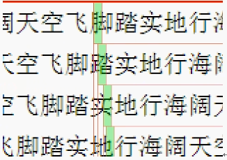

# 文字相关的属性
## color
* 文字颜色属性，这个属性能够继承，能够使用3中表示法来表示
## font-size
* 文字大小，他是有单位的，现在只学习一个单位就是像素。在响应式中，还会讲解rem、em单位。
* 如果设置font-size:20px;
    * 实际测量饱满汉字的真实高度是18px.这是因为汉字在制作的时候就不是顶天立地的
    * 那么到底使用多少号字，根据设计师给的设计图来设置
    * 注意
        * 网页上的字为不消除锯齿
        * 如果设计图中没有给出具体的字号，绝对不能够直接量汉字的大小，必须自己击打几个汉字来比较(多击打几个汉字来进行比较，都比较重合才说明字号合适)
        * 各个浏览器的默认字号都是不一样的，有的是12px,有的是14px,所以设计图上的文字都要写字号。
            * Chrome浏览器最低支持的字号为12px,低于12px仍然以12px显示。
## line-height
* line-height 表示的是行高
    * 
    * 文字所在这一行的高度称之为行高，文字在行里垂直居中。
    * 文字的字号可能是模糊的，不精确的，但是行高是确定的精确地
    * 行高怎么设置，看设计图
        * 明确带有行高
            * 直接写
        * 不带有行高
            * 切图去测量
            * 写上下两个字去测量，注意多写几个字
* line-height 可以使用px为单位，也可以使用百分比为单位
    * 如果使用百分比为单位，那么就是当前字号的百分比
        ```
            font-size:14px;
            line-height:150px;
            等价于
            font-size:14px
            linee-height:21px;
        ```
    * 由于字号和行高属性非常重要，所以可以和写在一起成为font属性
        ```
            font:14px/28px '宋体';
            等价于
            font-size:14px;
            line-height:28px;
            font-family:'宋体';
        ```
## 字体
* font-family 属性就是字体，所有的字体都要使用英语引号引用起来。
* 注意： 字体不是随意设置的，必须是用户的电脑中有这个字体，才能够设置，否则看到的是宋体，所以为了让用户有一致的体验，网页只用宋体和微软雅黑(也有黑体和楷体)
    * 一般来说，如果设置为微软雅黑，都会设置备选字体一般为宋体，使用逗号隔开设置
        `font-family:"微软雅黑", "宋体"`
    * 等价于   `font-family:'Microsoft YaHei', 'SimSun'`
    * 英文字体
        * Arial
            * `font-family: Arial, 'Microsoft YaHei', 'SimSun'`
            * 可以写在前面，用来设置英文的字体
            * 因为Arial中没有中文字体，所以无法使用Arial.会使用备用字体微软雅黑来设置中文，而遇到英文就是直接使用Arial字体
            
## 加粗
* 加粗
```
    font-weight:bold;
    font-style:italic;
    text-decoration:underline;
``` 
* 注意
    * `font-weight:bold;` 等价于`font-weight:700;`
    * 不加粗要使用 `font-weight:normal;` 等价于 `font-weight:400`
        * 可以将一个默认加粗的元素变成不加粗，例如 h1标签
* 是一个能够继承的属性

## 倾斜
* 如果想要文字倾斜，使用`font-style:italic;`
* 区别(主要在英文中会体现出来)
    * italic
        * 会采用一个新的字体样式
    * oblique
        * 会将文字倾斜
        
## text-decoration属性
* 字符装饰属性 
    * none
        * 默认的，标准文本，没有上下划线
    * underline
        * 定义文本下的一条线
    * overline
        * 定义文本上的一条线
    * line-through
        * 定义穿过文本下的一条线
* 演示
    * 下划线
        `text-decoration:underline;`
    * 没有下划线
        `text-decoration:none;`
    * 删除线
        `text-decoration:line-through;`

## 综合属性 font
* font属性是一个大综合属性：
    `font:italic bold 12px/20px arial`
* 等价于
    ```
        font-style:italic;
        font-weight:bold;
        font-size:12px;
        line-height:20px;
        font-family:arial;
    ```
* 一般不会综合的这么全
    `font: 12px/200% "microsoft YaHei", 'SimSun'`


