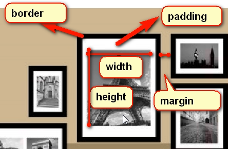
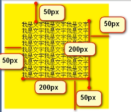

# 盒子模型
## 简述
* 盒模型就是width、height、padding、border、margin外边距这么几个属性。
* 图解
    
    
    * width
        * 内容的宽度
    * height
        * 内容的高度
    * padding
        * 内边距
    * border
        * 边框
* width_padding
    * 案例一
    
# 注意
* 一定一定要养成一个习惯，就是一个盒子的width属性，不是真实占有的宽度！
* 真实占有的宽度 = width + 左边padding + 右边padding + 左边border宽度 + 右边border的宽度   
    
## padding
* 内容和边框之间的距离
    * padding : 50px;
    * 四个方向的padding就都设置为50px了
* 单独设置 padding
    * padding-top:10px;
    * padding-right:20px;
    * padding-bottom:30px;
    * padding-left:40px;
* 等价于
    * padding 10px 20px 30px 40px;
* 如果写三个数值
    * padding 10px 20px 30px;
    * 等价于
        ```
            padding-top:10px;
            padding-right:20px;
            padding-bottom:30px;
            padding-left:20px;(和右一样) 
        ```
* 如果写两个数
    * padding 10px 20px;
    * 等价于
        ```
            padding-top:10px;
            padding-right:20px;
            padding-bottom:10px;(和上一样)
            padding-left:20px;(和右一样) 
        ``` 
    