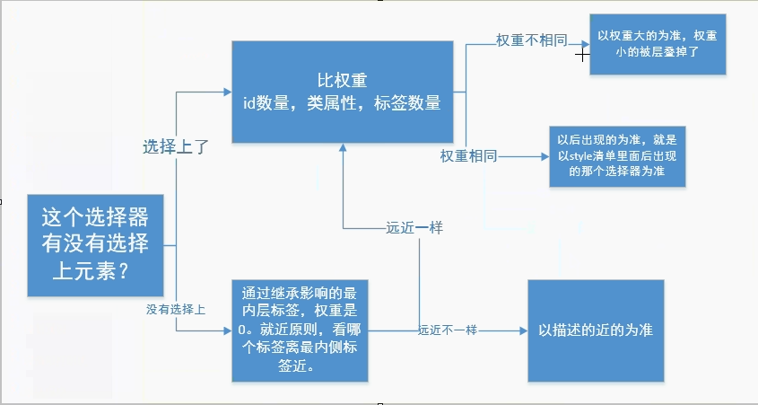

# 层叠性和继承性

* cascading style sheet, 我们对于cascading这个词只要理解透彻了，css就理解透彻了。实际上我们现在已经知道了cascading的第一层含义，就是同一个标签可以从多个选择器那里得到样式,样式时一层一层抹上去的

## 继承性
* 继承性简化了css的书写。
* 一些属性，如果给一个元素设置了，那么他的后代的所有元素都会有这个属性，这就是继承性
* 那些属性能够继承
    * color
    * text-
    * font-
    * line-
* 注意 background-color,盒模型属性(width,height, border,padding,margin)等都不能继承 
* css1中没有继承性，在css2.1开始支持继承性
* 常见继承属性
    ```
        1、字体系列属性
    　　font-family：字体系列
    　　font-weight：字体的粗细
    　　font-size：字体的大小
    　　font-style：字体的风格
    
    　　2、文本系列属性
    　　text-indent：文本缩进
    　　text-align：文本水平对齐
    　　line-height：行高
    　　word-spacing：单词之间的间距
    　　letter-spacing：中文或者字母之间的间距
    　　text-transform：控制文本大小写（就是uppercase、lowercase、capitalize这三个）
    　　color：文本颜色
    
    　　3、元素可见性：
    　　visibility：控制元素显示隐藏
    
    　　4、列表布局属性：
    　　list-style：列表风格，包括list-style-type、list-style-image等
    
    　　5、光标属性：
    　　cursor：光标显示为何种形态
    ```

## 层叠性
* 处理冲突的能力，就比如一个标签p，用标签选择器设置文字颜色是红色，用id选择器设置文字颜色是蓝色，那么听谁的。听id的，标签选择器的属性就被杠掉了，术语叫做“层叠”掉了. 
* 关系图

     
    
* 探究
    ```
        <style>
            haha{
            }
            xixi{
            }
            
            <p class="xixi haha"></p>
            
            一个标签可以同时携带多个类，那么如果一个类名设置为红色，一个类名设置为绿色那么会听谁的
            也就是说，两个类名之间有没有权重上的优先级？
        </style>
    ```   
    * 结论
        * 如果同一个标签携带多个类型，而这几个类名设置的样式如果有冲突，那么之和css的顺序有关，与HTML中类名的顺序无关
   