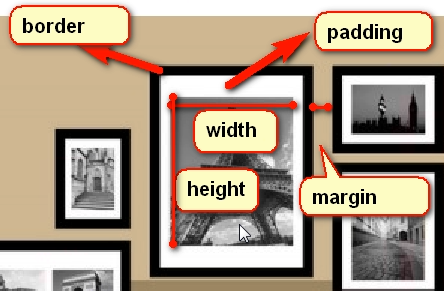
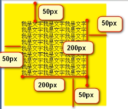

# 盒子模型
## 简述
* 盒模型就是width、height、padding、border、margin外边距这么几个属性。
* 图解
    
    
    * width
        * 内容的宽度
    * height
        * 内容的高度
    * padding
        * 内边距
    * border
        * 边框
* width_padding
    * 案例一
    

# 注意

* 一定一定要养成一个习惯，就是一个盒子的width属性，不是真实占有的宽度！
* 真实占有的宽度 = width + 左边padding + 右边padding + 左边border宽度 + 右边border的宽度   
    
## padding
* 内容和边框之间的距离
    * padding : 50px;
    * 四个方向的padding就都设置为50px了
* 单独设置 padding
    * padding-top:10px;
    * padding-right:20px;
    * padding-bottom:30px;
    * padding-left:40px;
* 等价于
    * padding 10px 20px 30px 40px;
* 如果写三个数值
    * padding 10px 20px 30px;
    * 等价于
        ```
            padding-top:10px;
            padding-right:20px;
            padding-bottom:30px;
            padding-left:20px;(和右一样) 
        ```
* 如果写两个数
    * padding 10px 20px;
    * 等价于
        ```
            padding-top:10px;
            padding-right:20px;
            padding-bottom:10px;(和上一样)
            padding-left:20px;(和右一样) 
        ``` 
    
## margin水平方向布局

1. 实例
    
    ```html
    <style>
       .box1{
           width: 500px;
           height: 200px;
           border: 4px solid red;
       }
       
       .box2{
           width: 100px;
           height: 100px;
           background-color: #bfa;
       }   
    </style>
   
    <div class="box1">
       <div class="box2"></div>
    </div>
    ```

2. 子元素在父元素中的水平方向布局
    
    1. 势必会满足，margin-left + border-left + padding-left + width + padding-right + border-right + margin-right = 父元素的width
        
        * 如果这七个值的和相加不等于父元素的宽度，则属于过度约束，浏览器会自动调整右外边距的值
        * 水平方向，有三个值可以设置为auto
            * margin-left
            * width
            * margin-right
         
## 垂直方向的布局

1. 公式
    
    * mt + bt + pt + height + pb + bb + mb = 父元素的高度
    * 可能

2. 如果不为父元素指定高度, 则父元素会自动适应子元素的高度
    
    * 能确保容纳所有子元素
    * 如果父元素指定了高度，则指定多少就是多少，如果子元素

3. 可以使用`overflow`来设置溢出内容的处理方式
    
    * visible: 默认值，溢出内容直接在外部显示
    * hidden: 溢出内容会被裁剪，超过父元素的不会显示
    * scroll: 生成滚动条，可以通过滚动条查看完整内容， 一直在
    * auto: 根据需要生成滚动条

## 外边距的折叠

1. 垂直方向，兄弟元素之间的相邻的外边距，会发生外边距折叠现象
    
    * 兄弟元素间相邻外边距，会取两个外边距之间的最大值
    * 如果是负数外边距，则会去绝对值较大的
    * 一正一负，取两个值的和
    
2. 父子元素之间
    
    1. 例子
        
        ```html
        <style>
           .box1 {
               width: 200px;
               height: 200px;
               background-color: #fff;
            }  
           .box2 {
               width: 100px;
               height: 200px;
               background: orange;
               margin-top: 100px;
           }   
        </style>
        <div class="box1">
           <div class="box2"></div>
        </div>
        ```
    2. 外边距的折叠
        
        * 父子元素的相邻垂直外边距，子元素的外边距会传递给父元素
        
    3. 解决方式
        
        1. 不使用margin, 使用padding
        2. padding, border

