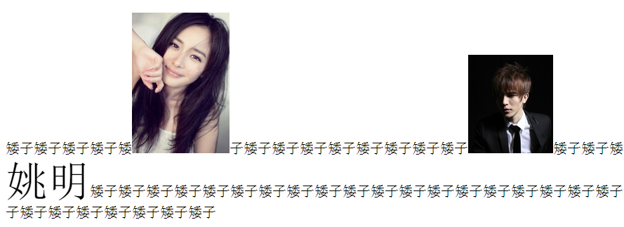

# 标准文档流

## 什么是标准文档流
* 我们发现，Fireworks作图，可以在任何一个地方落笔；word这个软件则不一样，有一个“光标”位置，你必须在当前光标位置去书写文字。
  第二行文字的位置，仰赖于第一行文字，比如第一行文字多，第二行文字就下移了；比如第一行文字大，第二行文字又下移了。
  网页也是这样，从左至右、从上到下，有一个“光标”的概念。 标准文档流中，内置了很多性质。

## 标准文档流有什么性质

1. 标签内的文字，不管有多少个空格、换行、tab，都会缩减为同一个空格。
2. 高矮不齐，底边对齐
    * 
## 块级元素和行内级元素
