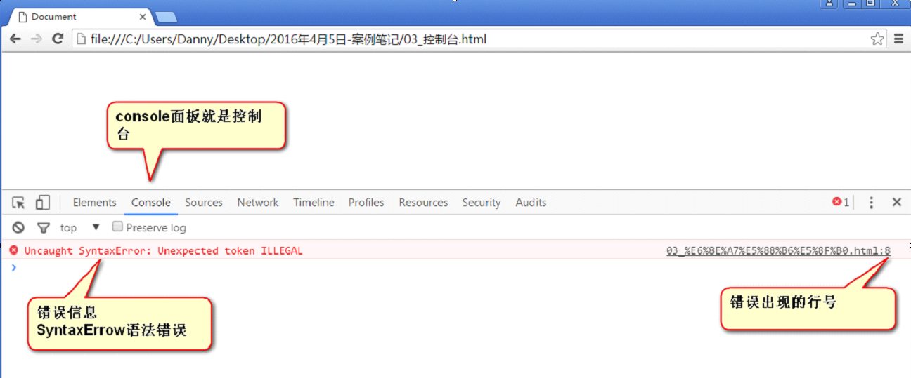

# 控制台、行文规范和注释
## Chrome 浏览器控制台
1. 控制台是Chrome浏览器“检查”里面的功能，快捷键是F12。英文叫做console。
2. 程序的所有未捕获的错误，都会在控制台中输出。控制台是调试程序的一个利器。
3. 比如下面的语句用了中文的符号，有语法错误：
    
4. 有时候我们想要在控制台中输出一些内容，需要使用`console.log('my');`
    * console 就是控制台，log是日志的意思，这里是动词表示打印的意思
    * 后面我们会知道，console是一个内置对象，log是他的一个方法
     
## JavaScript 行文格式
* JavaScript 语句和语句之间的空格、换行、缩进都不敏感。
    ```
        <script type="text/javascript">
            alert('first'); alert('two');
            
                    alert('hello world')
        </script>
        
        等价于
        
        <script type="text/javascript">
            alert('first'); 
            alert('two');
            alert('hello world')
        </script>
    ``` 
* 通常页面做好之后会使用工具对于页面进行压缩，去掉所有的空格换行。此时语句末尾的分号就显得非常重要，如果去掉分号，压缩之后就不能执行。
* 不压缩的时候分号通常不是必须的但是尽量所有的语句都是用分号结尾
    
## JavaScript 注释
* 给人看的东西，对于读程序是一个提示作用
* HTML 注释
    `<!--我是HTML注释-->`
* CSS 注释
    `/* 我是注释 */`  
* JavaScript 注释
    ```
        // 我是注释
     
        /* 
            我是一个多行注释 
            我能注释很多行
        */
    ```
    * 注意
        * 单行注释中可以嵌套单行注释和多行注释
        * 但是多行注释中只能嵌套单行注释，不能够嵌套多行注释
        

    
    
    
    
    
    
    
    
    
    
    
    
    
    
    
    
    
    
    
    
    
    
    
    
    
    
    
    
    
    