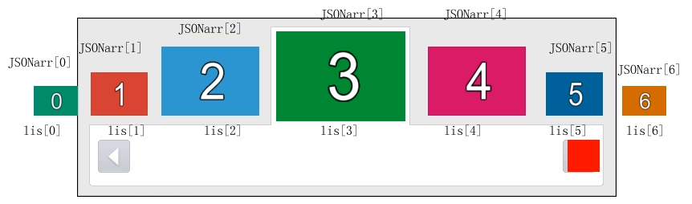
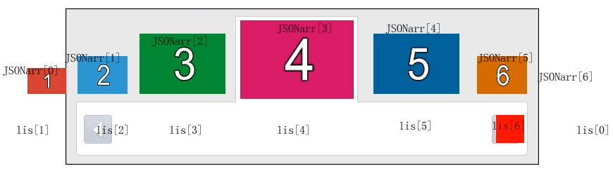
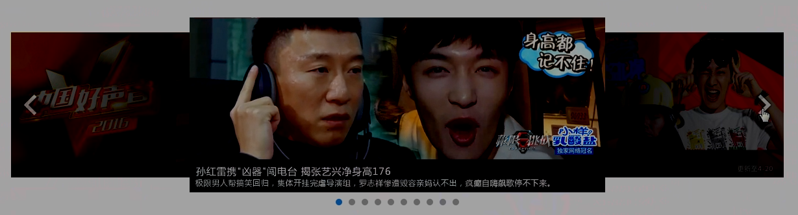

# 异形滚动
## 异形滚动的小Demo
1. 注意，图片默认不会因为父盒子的改变而改变，因为图片是会向外拓展的，会超出父盒子范围
    ```
    可以设置图片的宽度和高度都是100%
    这样图片就能够随着他的父盒子改变而改变
    ```
2. 异形滚动原理
    * [source](file/01_异形滚动_demo.html)
    * [source](file/02_异形滚动_更快的获得JSON.html)

## 第二次点击原理
1. 初始状态
    * 
2. 第一次点击之后的状态
    * 
3. 再次点击，强改序号
    * .png)
    
## 异形滚动
1. 尝试
    * [](file/03_异形滚动_第二次点击_尝试.html)
2. 新方法
    * [](file/04_异形滚动_第二次点击_new.html)
3. 完成
    * [](file/05_异形滚动_finish_opacity.html)


## 思考
1. 优酷的轮播图
    * 
2. 如何放更多张图
