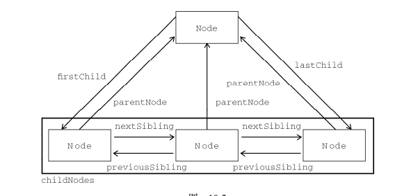

# 节点关系
1. 原生js中的节点关系
    * 原生js中的节点关系特别少，childNodes,firstChild,lastChild,parentNode,nextSibling,previousSibling
    * 图解
        * 
    * 并且在高级浏览器和低级浏览器中，节点的关系表示不一致
        * 高级浏览器会把每个元素间的换行空格抽象为一个文本节点，
        * 低级浏览器中不会管这些
    * 解决办法--(到底空文本算不算儿子)
        ```
        // 返回obj的所有标签儿子
        function(obj){
            var arr = [];
            for(var i = 0; i < obj.childNodes.length; i++){
                // 找真正的节点，忽略文本节点
                if(obj.childNodes[i].nodeType == 1){
                    arr.push(obj.childNodes[i]);
                }
            }
            return arr;
            // 返回的是某一个儿子或者所有儿子
            // return num? arr[num]: arr;
        }
        ```
    * 同样的道理 firstChild,lastChild也是这样，一般不用
2. 有指向前面兄弟的属性，没有指向前面所有兄弟的属性
    * 依旧存在兼容性问题，比如前一个兄弟节点会找到文本节点
    * 解决办法
        ```
        // 返回obj前面一个兄弟
        function prevSibling(obj){
            var prev = obj;
            while (prev = prev.previousSibling){
                if(prev.nodeType == 1){
                    return prev;
                }
            }
            return null
        }
        ```
        ```
        // 返回obj前面所有的兄弟
        function prevAll(obj){
            var prev = obj;
            var arr = [];
            while (prev = prev.previousSibling){
                if(prev.nodeType == 1){
                    arr.unshift(prev);
                }
            }
        }
        
        ```
3. 小案例
    * [子复选框勾选父元素变色](file/01_子复选框勾选父元素变色.html)        
        * 复选框，文本框，单选按钮，值被改变的时候，触发的是onchange事件
        * 复选框，单选按钮的选中情况，是属性checked属性，是一个布尔值
    * [原生水平菜单](file/02_原生水平菜单.html)