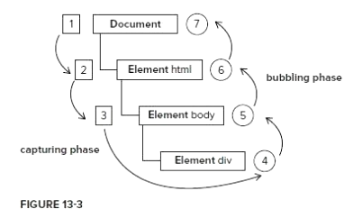

# 事件深入
## 事件流
* 当你单击了某个元素，点击事件不仅仅发生在这个元素上面，你也单击了他的parentNode,他的祖先元素，甚至单击了整个页面，事件流描述的是页面上各个元素接受事件的顺序
    * [source](file/01_点击会触发祖先盒子的事件.html)
* 我们为了描述事件的传播顺序，特意人为规定了两个阶段，捕获阶段(capture pahse),冒泡阶段bubbling phase,并且捕获阶段要咸鱼冒泡阶段。点击页面上的一个元素，事件在哪个阶段触发，这取决于添加事件监听的方法
    * 

## DOM 0级事件绑定
* DOM是分级别的，DOM0级，1级，2级，3级，是不同的标准，标准一直在升级
* 之前的`oDiv.onclick = function(){}`，是dom 0级别的事件绑定，就是把onclick当作属性添加给了oDiv这个元素，通过实验可以发现, ***这种绑定方法添加事件，只会监听冒泡阶段*** ， 也就是说，事件的发生顺序就是从最内层-> 最外层
* 需要注意，在IE9和chrome里面，事件会冒泡到window对象， ***但是IE6, 7, 8 仅仅只会冒泡到document对象中*** 
    * [source](file/02_Dom_0级别事件绑定_只能监听冒泡阶段.html)

### this绑定问题
* 使用Dom 0级绑定的事件，this指的就是触发这个事件的元素,没有任何浏览器兼容问题
    * [this是谁](file/03_Dom_0级别事件绑定_this是谁.html)
    * [this嵌套问题](file/04_Dom_0级别事件绑定_this嵌套问题.html)

## DOM 0级别另一种事件绑定方法(不允许使用)
* 可以直接将dom 0级别事件写在html代码中，但是不能使用，造成代码耦合性很强，三层没有分离，一样是监听冒泡阶段
    * [source](file/05_dom_0级别另外一种绑定事件的方式_直接写在标签里.html)

## DOM 0级别事件监听，同一个元素不能有两个同样的事件监听
* 比如两个onclick,后写的会覆盖先写的
* 使用dom 0级别，同一个元素不能有两个同样的事件监听，比如
    ```
    box1.onclick = function(){alert('1111');}
    box1.onclick = function(){alert('2222');}
    ```
    * 以后写的js代码为准，会覆盖先写的函数
* [source](file/06_DOM0级绑定监听-后写的会覆盖先写的.html)


