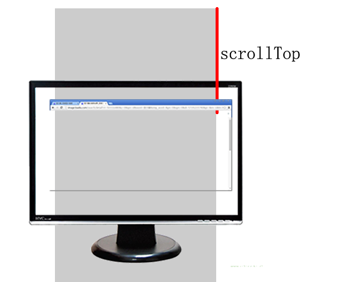

# 得到页面的净位置和盒子内坐标值
## 得到一个元素在页面中的top值
* [得到净位置](file/01_得到一个元素在页面中净位置.html)
    * 我们之前的学习过一个属性oDiv.offsetTop指的是这个盒子的border外层到自己的offsetParent的border内侧(iE8多算了border),至于offsetParent是谁，IE 6,7还有不同的理解
    * 我们现在说的是oDiv这个元素在页面中的净位置，起一个名字叫做allTop
    * 其实就是一层一层的累加offsetTop
* 得到页面的净位置，只要没有边框，这个轮子就会特别好用(因为任何原因引起的盒子离顶部高度变化都能够求取到)
* 一层层迭代，直到offsetParent为null
    ```
    //返回这个元素在页面中的净位置, 就是这个元素所有offsetParent的offsetTop值的和
    function getAllTop(obj){
        //累加器，累加器的初始值不是0，而是自己现在offsetTop值
        //一会儿while语句直接从它爸开始了
        var allTop = obj.offsetTop;
        //当前正在算高度的元素
        var currentObj = obj;
        while(currentObj = currentObj.offsetParent){
            allTop += currentObj.offsetTop;
        }
        return allTop;
    }
    ```


## 得到页面的卷动值
* 卷动值
    1. document.body.scrollTop
* 图解
    * 
* 案例
    * [卷动值展示](file/03_得到页面的卷动值.html)
    
## 页面的卷动事件
* 窗口的卷动事件，无论因为什么(比如鼠标拖拽滚动条，鼠标滚轮，键盘pagedown,键盘下箭头)导致了页面的卷动，都会触发这个事件
* `window.onscroll = function(){  }  // 当窗口卷动的时候发生这个事件`
* 浏览器对于scrollTop属性是body的属性还是html元素的

## 浏览器窗口的宽度高度
* `var width = document.documentElement.clientWidth || document.body.clientWidth`
* `var width = document.documentElement.clientHeight || document.body.clientHeight`

## 得到鼠标在盒子内的坐标
* [得到鼠标在盒坐标](file/02_得到鼠标在盒子内坐标.html)
    ```
    
    ```

## 鼠标到盒子的距离
* event.clientX
* event.clientY


