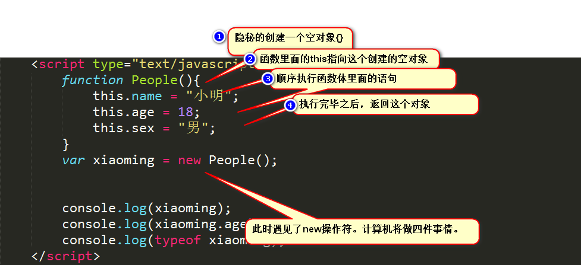

# 构造函数
1. JavaScript规定，一个函数可以使用new关键字来调用，那么此时将会按顺序发生四件事情：
    1. 隐秘的创建一个新的空对象
    2. 将这个函数里面的this绑定到刚才创建的隐秘新对象上面
    3. 执行函数体里面的语句
    4. 返回这个新的对象
    
2. new执行机理
    * 
        * 也就是说，我们又学会了一种函数新的调用方式，使用new关键字来调用。此时的函数很有意思，函数不仅仅能够执行还会返回出来一个对象。
        * 也就是说对象是函数生出来的，对象是函数new出来的。我们称呼这个函数是构造函数，一般的构造函数使用大写开头。也叫做People类，称呼lcwspr这个对象是People类的实例
    * 构造函数也是函数，当然也可以直接通过()运算符进行调用，只不过此时的this指向window

3. 构造函数
    * 例子: [source](file/01_构造函数.html)
    ```
    function Employee(name, age, sex) {
        this.name = name;
        this.age = age;
        this.sex = sex;
    }
    // 使用new关键字造出来的员工，称之为员工类的实例
    var xiaoming = new Employee("小明", 18, "男");
    var xiaohong = new Employee("小红", 39, "女");

    console.log(xiaoming);
    console.log(xiaohong);
    ```
    * 真实社会，自然中万物分为各种各样的种类，人类，鸟类.是因为他们有着不同的属性群,也就是说,有着相同属性群的物种,就可以称之为一类.
    * 所以,我们的构造函数也可以看作类的定义
    
4. js语言是基于对象的语言
    * Employee这个函数一会将会使用new关键字来调用,所以称为构造函数
    * 构造函数里面的语句将会执行,并且将会返回一个对象,所以new多少次,里面的语句就会执行多少次.宏观来看,返回的对象,就都有name属性,age属性,sex属性,这些返回的对象都有相同的属性群了,所以可以看作是一类东西,那么Employee这个构造函数,也可以看作类的定义
    * 但是javascript中没有类的概念,是通过构造函数的4步走机制来创建类似的对象,可以看为类,JS这个语言"基于对象(base object)",不能叫做"面向对象的语言(orinted object)"

5. 注意,面向对象语言的惯例,构造函数以大写字面开头 `function People(){}`,表名这个函数一会要使用new来调用,能够返回该类的对象,类就是对象的模板
    
6. 类和实例
    * 类就是蓝图, 对象就是依据某个蓝图做出的事物,也称为实例
    * 构造函数中,肯定会出现this语句,如果没有this语句,那么就相当于不能给创建出来的空对象绑定属性.

7. 构造函数深入
    * [source](file/03_再次构造函数.html)
    * 在js中,构造函数就是一个普通的函数,JS没有对里面要书写什么进行任何规定.只不过一般习惯上会使用this.*** = **来罗列所有属性,然后罗列所有的方法而已,
        * 注意 ***new一个函数的时候,里面的语句会执行***
    
8. 总结: 其实就是一种新的调用函数的方式
    1. 当一个函数使用()调用的时候用,this就是window
    2. 当一个函数用对象方法调用的时候,this就是这个对象
    3. 当一个函数绑定给一个html元素事件的时候,this就是这个html元素
    4. 当一个函数用定时器调用的时候,this就是Window
    5. 当一个函数使用apply, call调用的时候,this就是你指定的这个东西.
    6. 当一个函数使用new调用的时候,this就是隐秘创建的新对象
        * 函数里面的语句将会执行,并且返回新对象
        * 宏观来看,new出来的东西都有相同的属性群,方法群.此时我们可以发现,这个构造函数可以像模板一样,可以非常快速的制作类似的实例,我们可以称呼这个构造函数为类,他new出来的东西叫做类的实例
 
  