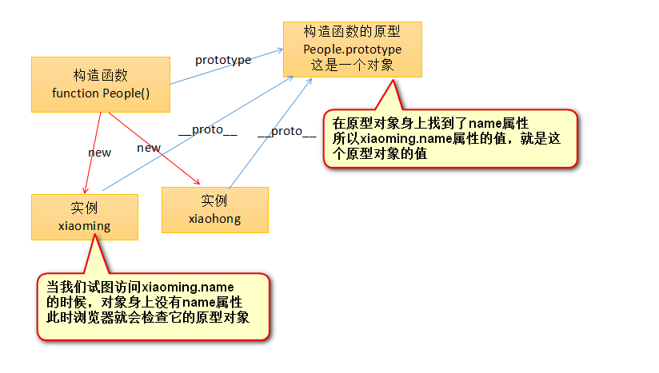

# 原型 prototype的定义
1. 例子
    ```
        function fun() {
            alert('你好');
        }
        fun();
        console.log(fun.prototype)          // Object(){}
        console.log(typeof fun.prototype)   // object
    ```
    * 在JavaScript中，任何一个函数，都有一个prototype属性，指向了一个对象。
        * 我们输出了一个函数的prototype属性，你会发现是一个空对象。
        * 输出这个prototype的类型,发现是object类型
    * prototype是英语原型的意思，每个函数都有原型，这个原型是一个对象。一个函数的原型，对于普通函数来说没有什么作用。但是如果这个函数是一个构造函数，那么函数的原型，用处极大

2. 原型揭示
    * [原型的定义](file/01_原型的定义.html)
    * prototype一定是函数的属性,当这个函数是一个构造函数的时候,那么他(构造函数)new出来的对象,将以他原型指向的那个对象,为new出来的实例的原型对象.
    
3. 原型对象
    * 图解
        * 
    * 注意: 任何一个对象,都有__proto__属性,这个属性是Chrome自己的属性,别的浏览器可能不兼容,但是别的浏览器也有原型对象,只不过不能通过__proto__进行访问,这个属性指向自己的原型对象.
    * 我们的JavaScript有一个非常牛逼的机制,原型链查找.当我们试图访问一个对象身上的属性的时候,如果这个对象身上有这个属性,则返回他的值.如果他身上没有这个属性,那么将访问他的原型对象.检测他的原型对象身上是否有这个值,如果有返回他原型对象身上的这个值.
        * 图解 
            * 

4. 总结
    1. 任何一个函数都有原型,原型是一个对象,用prototype来访问.
    2. 当这个函数是构造函数的时候,new出来的对象,他们的原型对象就是这个构造函数的原型.
        * prototype我们称为"原型",只有函数有原型
        * __proto__我们称为"原型对象",
        
  