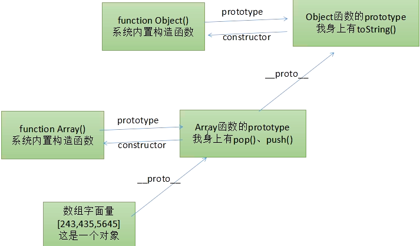
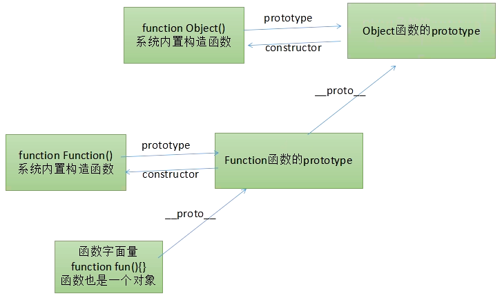
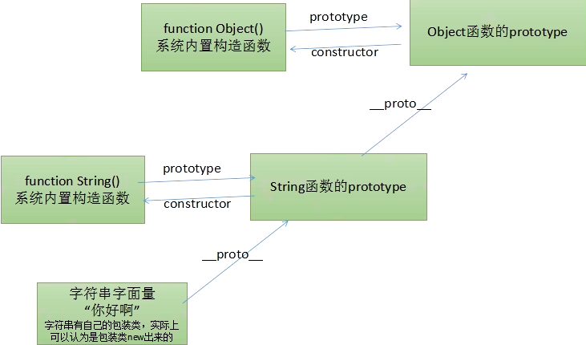

# 原型链机制
1. 原型中的constructor属性
    ```
        function Dog(){}
        console.log(Dog.prototype.constructor);
        console.log(Dog.constructor);
    ```
    * 函数的原型有constructor属性,指向构造函数
    * 我们之前说过,一个对象的原型身上有什么,实例对象就可以打点调用什么.因为constructor属性是实例原型对象身上的属性,所以通过实例对象也能够访问

2. 只要是对象,就一定有原型对象(除了Object.prototype),就是说,只要这个东西是个对象,那么就一定有__proto__属性。在世界上只有一个对象没有原型对象，这个对象就是Object.prototype
    * Object是一个函数，是系统内置的构造函数，用于创造对象。Object.prototype是所有对象的原型链终点，所以当我们在一个对象上打点调用某个方法的时候，系统会沿着原型链去寻找他的定义，一直找到Object.prototype
    
3. Object.prototype
    * Object.prototype是所有对象的原型链的终点，所以我们直接给Object.prototype增加一个方法，那么世界上所有的对象都能够调用这个方法。
    ```
    Object.prototype.haha = function(){
        alert('hahahah');
    }
    ```
    * 所有的引用类型值，都有内置的构造函数，比如
        * new Object()
        * new Array()
        * new Function()
        * new RegExp()
        * new Date() 
  
4. 数组的原型链
    * 
      
5. 函数也是对象，JavaScript中函数是一等公民，函数也是对象。函数也是对象，不过自己能加引号执行
    *    
    
6. 基本类型值也有
    * `var str = new String('heheh');`
    * 基本类型值，比较的是值，对象比较的是地址
        ```
        var str1 = "你好呀";
        var str2 = "你好呀";
        console.log(str1 === str2);
        ```
    * 字符串的常量值虽说不是一个对象，(不能直接使用常量值调用，先赋值给变量)但是也能够调用__proto__属性。这就是为什么字符串能够调用相关的方法
        * 
    
    

    
    
    
    
    
    
    
    
    
    
    
    