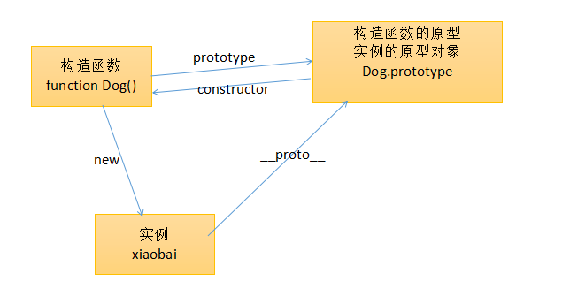
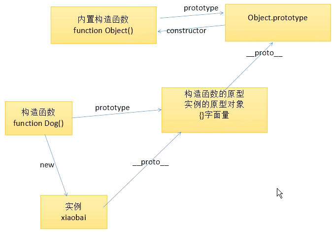

# 面向对象初步
1. 下面的代码
    ```
    function Dog(name, age){
        this.name = name;
        this.age = age;
    }
    var xiaobai = new Dog("baibai", 12);
    ```
    * 在Java,c++,c#中，就会思考成Dog是一个类，new操作就是实例化操作，把类实例化为一个对象
    * 但是，在js中是没有强的类的概念的，在js中Dog就是一个函数，new只不过是他的一种调用方式而已，就如同函数有很多方法调用，比如()直接调用，事件监听调用，定时器调用。new其实就是一种新的调用函数的方式。
    * 上面所说的调用方式，函数内部的this不一样，甚至极端的说，函数的调用方式的不通过，就体现在this的值的不同
        * new的时候，就是会调用函数，并且会新建一个空的对象，然后执行语句，此时this就是指的创建出来的新对象，并且当函数中的语句执行完毕之后，一个对象会被返回。
    * 返回的对象，可以叫做类的实例，并且，这个实例的原型对象就是构造函数的原型

2. 图解原型和原型对象
    * 
    * 两种给原型添加属性的方式
        * 第一种追加属性
            ```
            Dog.prototype.sayHello = function () {
                console.log(this.name);
            };
            ```
        * 直接覆盖整个原型
            ```
            Dog.prototype = {
                sayHello: function () {
                    alert(this.name);
                }
            };
            ```
            * 会输出不了构造函数，有隐患，就是你的Dog.prototype与构造函数(Dog)失联了.也就是无法通过Dog.prototype.constructor访问构造函数Dog，这是因为对象字面量的constructor一定是Object
            * 图解： 
            * 如果真的认为constructor这么重要，那么可以直接补一个constructor.但是constructor经常弄丢，比如在继承实现，constructor经常丢失
                ```
                Dog.prototype = {
                    constructor: Dog,
                    sayHello: function(){
                    }
                }
                ```
    
3.  JavaScript与面向对象
    * JavaScript本身就是函数式的，只不过有了new关键字，有了构造函数的特性，所以js中的面向对象的编程风格，js中只是用来组织代码用的。

    