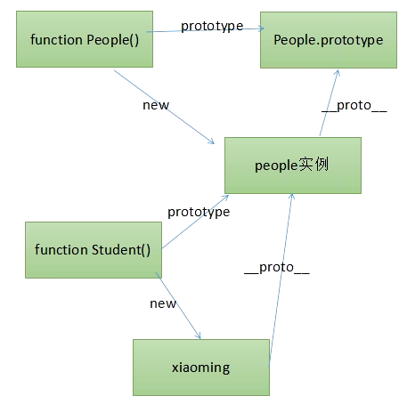
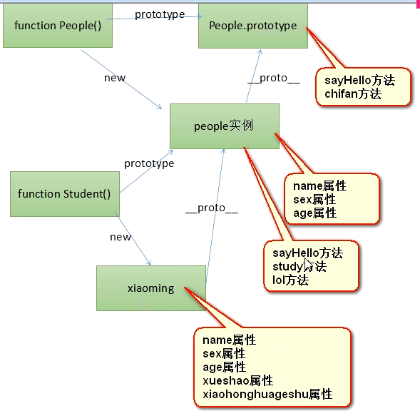

# 继承
## 案例引入
* 人类，小学生类，小学生也是人，只不过丰富了人类。
    * 人类有的属性，小学生都有，比如姓名，年龄，性别，人类的方法，睡觉，吃法，打招呼
    * 此外小学生还丰富了一些属性，学号，班级，丰富了一些方法，学习,lol
* 继承是丰富，要比原来的东西要多东西。
* People(),Student两个类，Student类的实例，拥有People类的全部属性方法，朦胧感觉到会使用原型链来结束
    * People 叫做父类，超类，Student叫做子类，基类

## 继承图解
1. js继承实现
    * 子类的prototype等于父亲的某个实例
    * 子类可以覆盖父类的一些方法，父类的方法不会冲突，因为我们子类追加的方法，追加到了父类的实例上面
    * 
2. js原型链查找
    * 
    * 如果直接把自类的原型等于父类的原型，那么添加子类特有方法会影响父类
    

## this讲解
1. 函数调用的时候所处的this环境，跟调用他的函数那个函数中的this没有任何关系