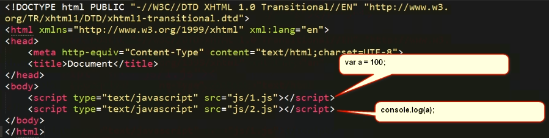
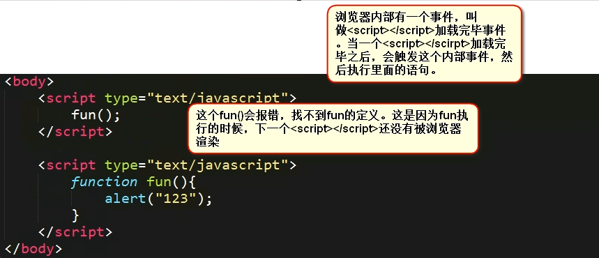

# javascript代码的组织和维护
## 外链JavaScript
1. 外链JavaScript是一个组织代码很好的方式
2. 特点
    1. 外链js和引包顺序是有关系的
        ```
        <script src="test_file/1.js"></script>
        <script src="test_file/2.js"></script>
        ```
        * js的执行顺序就是引包顺序的先后
    2. 包是不能隔开作用域的
        * 
            * a能够正常输出，(js包是不能隔开作用域的)。在JavaScript中，唯一能够隔开作用于的就是function.
            * JS包里面定义的变量，函数，将在html外部失去变量声明的提升，函数声明头的提升
            * 本质上，写在不同\<script>\</scrip>标签对里面的变量，函数，就已经失去了变量声明的提升，函数声明头的提升。
                * [不同的Script标签变量声明提升不起作用](file/02_变量声明的提升在不同script标签里面失效.html)
                * 浏览器渲染有一个内部事件，叫做当前script标签加载完毕，就会立即执行里面的js语句，不必等待其他script标签加载
                * 
            
    3. 如此来说
        ```
        <script src="1.js"></script>   这个包里面定义了函数fun
        <script>
            fun();    // 执行fun的时候，浏览器已经认识了fun
        </script>
        ```        

## 页面中的js与html
* 页面中的js写在哪里
    * 页面中会出现很多很多的js特效，那么此时js的摆放的位置，应该放到html结构的后面，并且习惯上紧紧跟着html结构。这样做的好处就是，我们久知道每个JavaScript的含义了，就知道这个JavaScript是负责上面这个html结构的效果的
                                             d
## window.onload
1. 延迟加载，当页面中的所有元素都加载完毕之后，触发这个事件。
    * 要注意，什么叫做所有元素加载完毕那？例如页面上的img文件，都是一点一点通过http网络传输过来的， 当所有的img都传输完毕之后，才会触发window.onload事件。
    * 所以之前的时候，chrome有一个小bug,就是一个盒子如果是用img撑宽的，那么oDiv.clientWidth就是0，这是因为读取这个盒子的款的时候，这个img还没有加载完毕。
        * 
    * 解决方法就是写在window.onload事件里面，这个事件是当所有的元素都加载完毕的时候执行
    
2. Dom0级别事件中，不能出现同名的事件，如果出现同名的事件，那么会以后出现的为准。所以页面上只能有一个window.onload
    * 但是如果使用dom 2级别，`window.addEventListener("load", function(){},false);`就能够添加多个window.onload事件的处理函数，依次执行，注意attachEvent是反着的
    * jQuery中使用`$(document).ready(function(){});`,jQuery中所有的事件都是通过dom2级别添加的，所以jQuery中所有的事件都能够同名
        
3. 基本上，工作上是不允许使用window.onload的，因为会把js代码和html结构分开
    * 所以还是应该一个结构，一个js文件，一个结构一个js文件
    * 但是，window.load在应对两个东西的时候，有着非常大的作用 [show_that](file/)
        * 表单验证
        * onscroll事件
        
    * 学习一下表单事件，onsubmit事件表示表单试图提交的那个瞬间。这个事件只能加给form对象。当标签里面的submit按钮点击的时候，会触发
        ```
        form.onsubmit = function () {
            alert("哈哈哈，要提交表单，就不让");
            return false;  // onsubmit事件里面，如果写了reutrn false;就不能提交表单了
        }
        ```
        * 表单验证不会放到一个单独的js文件中，万一极端情况下，页面已经加载了，但是js文件还没有收到，那么服务器就会收到没有经过验证的数据。
        * 所以为了安全性，表单验证会写在window.onload里面。浏览器这样一定会绑定事件不会出现错误。表单的提交非常刚性，事关网站的安全，所以一定一定要写在window.onload里面，不要单独写js文件，不要写在html结构的后面
    
    * 还有onscroll事件，浏览器必须要第一时间知道，这个页面滚动条滚动，是有事件的
        * 注意onscroll是不能阻止默认事件的 
            

            
            
            
            
            
            
            
            
            
            
            
            
            
            
            
            
            
            
            
            
            
            
            
            
            
            
            
            
            
            
            
            
            
            
            