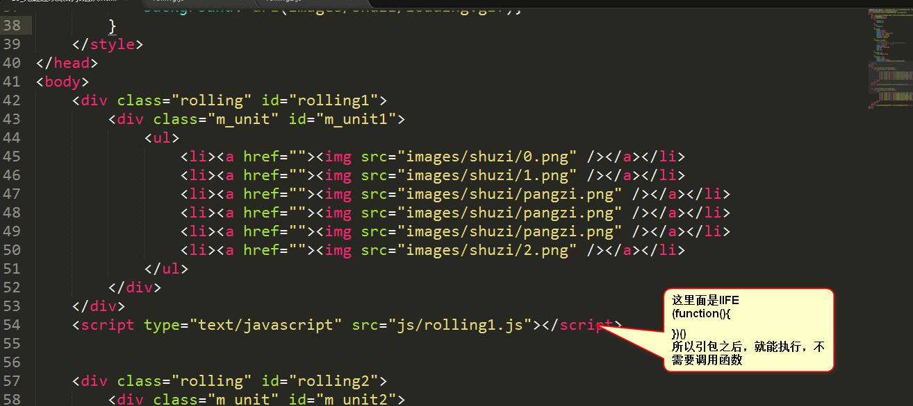
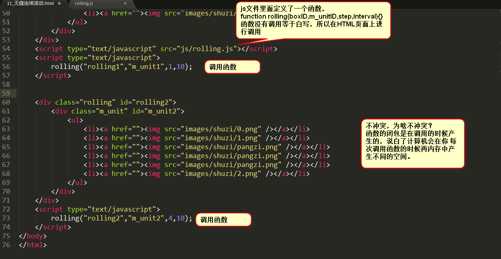

# 外链js文件策略
* 一个js文件不是一个作用域，但是我们依然希望一个js文件就是一个独立的作用域，所以，我们就需要把语句写在function里面。
        
    1. 如果直接将所有js代码放到一个js文件中
        * 存在问题
            1. 所有代码不需要调用能够直接执行
            2. 变量作用域冲突
        * 说明
            * 没有任何理由，将js文件里面的语句散着写，因为这样散着写全局作用域会被污染，多个效果之间的信号量会冲突。
            * 必须把js里面的所有语句放到函数里面，有三种方法
    
    2. 解决外链js文件作用域污染问题(3种方法)
        1. IIFE
            * 把js文件种的所有语句放到js文件种，就能够关住作用域，并且html文件种不需要调用函数
            * 图解
                * 
            * IIFE是个好东西，能够关住作用域，函数的闭包能够保护函数的每个变量与别人不冲突, 但是，有瑕疵，不方便二次使用这个函数。当页面上有两个轮播图的时候，同样的业务，必须要定义两次函数。而函数天生是要复用的，所以IIFE有缺陷。
        
        2. js文件中定义函数，在HTML页面上用()调用
            * 图解
                * 
            * 传统轮播
                * 
            * 这种调用函数的方式，就是使用()来进行普通的调用。(函数确实被复用了)
                * 问题在于垃圾回收和持久化的问题
                    * 如果一个函数内部的变量被一个内部函数所引用，并且这个内部函数被拿到其他作用域中，只要这个内部函数还被引用，那么就不会销毁外层作用域。
                    * 也就是当一个函数运行的时候，将为其中的变量分配空间，当函数执行完毕之后，如果其中的变量没有被任何定时器，时间监听所持有，为了节约内存空间，就回收了内存空间
                    * 那么如下语句
                        ```
                        function fun(){
                            var a = 1;
                            document.onclick = function(){
                                a ++;
                                alert(a);
                            }
                        } 
                        fun();
                        ```
                        * 变量a被事件监听所持有，所以fun虽然已经执行完毕了，但是浏览器依旧不敢去清除a变量空间，所以每次点击页面都会弹出2, 3, 4, 5..
                        * 
                    
            * 最近学过一种新的函数调用方式，就是使用new来调用函数。(实际上new就是组件开发)
        