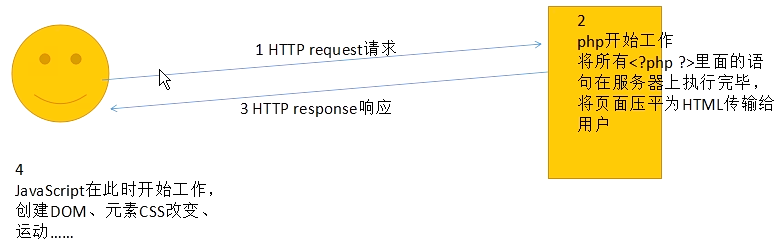

# php初步体验
* 现在的前端，实际上是因为所有的前端都是披着前端外衣的后台。也就是说，现在的后台完全可以不会后台。但是现在的前端必须要懂后台，
    * 因为现在的项目越来越复杂，更新迭代越来越快。所以工程上面，"轻后重前",也就是之前后台的项目，现在要逐步交给前端来完成。
    * 必须要学习后台语言
        * PHP，JAVA EE， .net, python, 
    
## 认识PHP
1. php
    * `<h1>哈哈哈，今天我买了一个<?php echo 1+2+3; ?>s 我好开心啊！</h1>`
    * php就是一个html中的内嵌语言： 使用<?php ?> 来表示php的定界符，写在这个符号里面的语句，都是PHP语句
    * php不能在本地直接拖入浏览器里面运行，这是因为php必须要有运行环境，我们的电脑上面没有PHP的运行环境，我们只能传递到服务器上面，此时的原代码
    
2. 前后台语言的区别
    * PHP应该叫做HPP，但是HPP难听，所以称之为PHP
        * 原称呼： Hypertext Preprocessor,超文本预处理器
    * php和js的运行环境
        * 
    * 问题： 如果一个人买了一天破电脑，没有PHP运行环境，那么能够看到php的页面吗？
        * 能，PHP程序会在服务器上解析成为全部的html，发送给客户机
        * 所以JS，CSS, HTML 都叫做前台脚本，实在客户端，浏览器端执行的。
        * 而PHP，JSP,ASP都是在服务器端运行的，叫做后台语言。
    * 那么任何后台语言都需要部署环境，注意，是要在服务器上面部署环境。而普通的访问者，不需要安装特殊的环境，这是因为服务器传回来的就是普通的HTML页面，服务器把php脚本已经做掉了，传回来的就是"压平"了的html页面，没有任何php痕迹。
    * 我们也把后台语言的源码，前资源台语言叫做静态资源。JS把页面做的在绚，也是静态资源，动态资源指的是能够和数据库交互
    * (所有的数据的增，删，改，查，都是服务器的业务，都是PHP的业务。所有的页面的样式，运动，交互，事件，表单验证都是JavaScript的业务)
    

## 环境搭建
*　让我们的计算机也成为一个服务器
* 一键环境安装包，之中包括了什么?
    * Apache : 阿帕奇，最著名的服务器软件，免费开源的，自己的ip地址就可以被别人访问了，访问的是根目录里面的文件。phpnow中,根目录是C:/phpnow/htdocs
    * php解释引擎： 有了阿帕奇，还是布恩那个解析php程序，不能运行PHP程序，所以安装包中还集成了php引擎，使得我们的服务器还能够运行PHP程序。
        * 现在一定要记住，运行php程序必须要输入127.0.0.1开头的网址，不能直接拖入浏览器，因为输入网址，就使用了php引擎解析页面了，直接拖入没有通过PHP引擎处理
    * MySQL: 读作"麦瑟kiu", 是著名的开源的数据库，mysql是著名的开源的，免费的数据库

