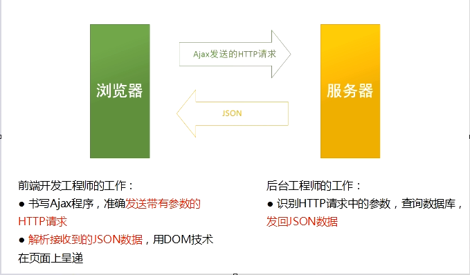

# Ajax整体感知
## http协议
* 超文本传输协议(HTTP, HyperText Transfer Protocal)是简单的，可靠的互联网文件传输协议，上网其实就是你输入网址之后，浏览器发出HTTP请求，请求服务器上的文件。服务器上的文件，再通过http传输到本地，在浏览器中进行渲染。
    * http是无连接的，就是访问一个网站，此时可能会产生多个http请求。请求html页面，请求jsp图片，请求外链css样式表。这些请求走过的路线可能会不一致。也就是说，没有和服务器有一个持久通路，你的每次请求HTTP完成之后，请求就关闭了，一个页面要多次打开，关闭HTTP
        * `tracert`
    * http文件的传输，不是一个文件整体传输，而是把一个大的文件，分成一个个报文(message),然后进行传输的，我们的浏览器渲染页面，是一块一块加载的，图片是一条一条显示的，
    * 一个jpg图片，也是通过多个报文回来的，每个报文都有非常大的字节量，在进行校验工作，保证这个报文里面的内容是准确的。是和服务器是一致的，所以http是可靠的，文件不会发生偏差。
* 一次HTTP请求，有上行request,下行response两个部分
    * 一个网页可能会产生多个HTTP请求。
    * 通常，浏览器产生HTTP请求，是由于用户输入了新的网址，或者点击了超级链接，使得页面跳转，这将导致页面的全局刷新，
    * 而AJAX技术可以使得网页悄悄地，偷偷的发起HTTP请求，请求回来的数据在页面局部刷新呈递。
## FTP
* 文件上传协议(FTP, file Transfer Protocal): 用于本地往服务器上面上传文件的。
    * 也是可靠协议，但是是有连接的

## network面板
1. network面板表示接受回来的文件，查看文件时，可以查看request的时候的报文头是什么

## Ajax技术欣赏
* 两个要素，
    * 带着数据上到服务器(get或者post,get是通过url,post报文头)
    * 传回JSON。
    * 组建dom，更新页面
* 也就是说，页面在偷偷请求一个数据。`www.bai.com/page/r.php?page=3`就会发现，相当于page=3这个参数请求给了服务器
    * 然后前端工程师，创建dom,改变布局

* 图解交互模型
    * 

## Ajax简介
* Asynchronouse JavaScript and XML (异步JavaScript和XML)
    * 实际上现在工作没有一个公司使用XML当作后台，前台的中介文件，都是使用json，所以AJAX应该改名为AJAX(Asynchronous JavaSCript and JSON),但是大家都还是约定俗成的称之为AJAX
    * XML和html很像，唯一的不同就是标签可以自定义，也是用来表达语义的，但是不用被浏览器呈递，就是负责交换信息的，现在已经被json替代。(xml后台难以生成，前台难以解析)
    
## AJAX简介
* AJAX不是新的编程语言，而是一种原来被人们放到角落里，突然被一个哥们推广，他是使用已有标准的新概念。
* 2005年，由美国人Jesse James Garrett推广，并且取名，其实这个哥们不是搞程序的，而是搞设计的，是交互设计达式，用户体验大师。
* 2005年，google通过其Google Suggest使得Ajax流行起来。
* 今天很少有网站不适用Ajax技术，Ajax对于智能手机支持很好，

