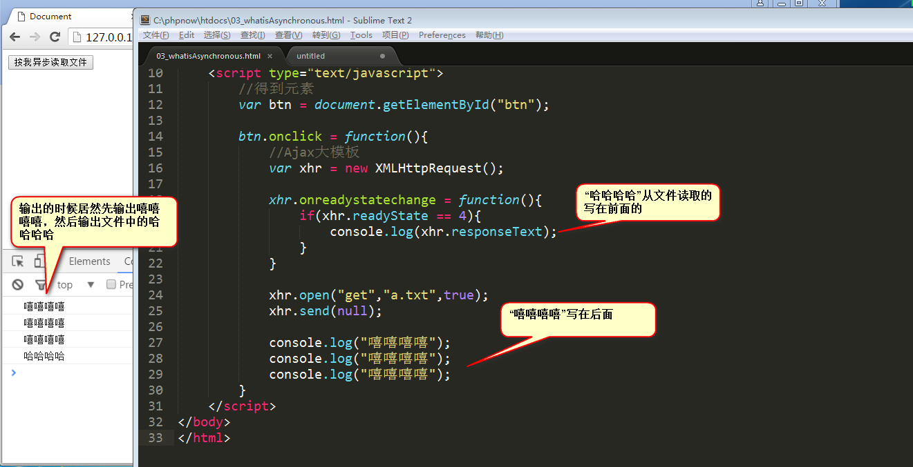
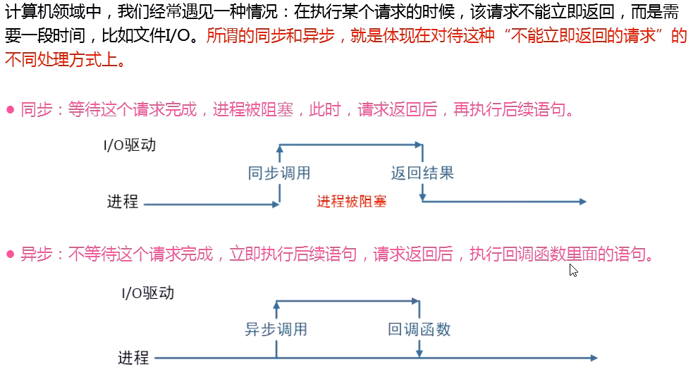
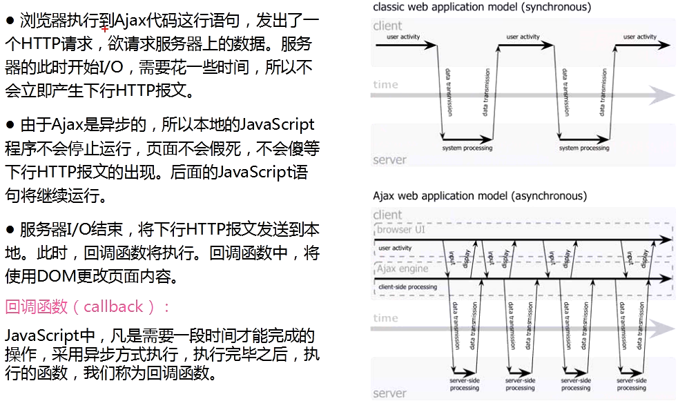
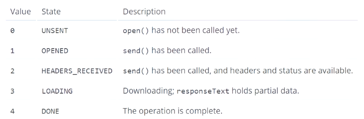
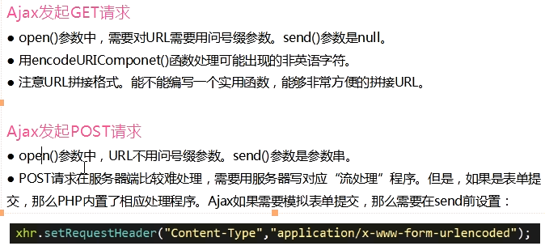
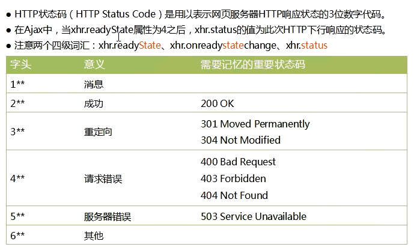
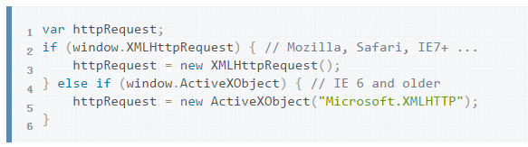

# XHR对象
1. 其实，ajax完全依赖XMLHttpRequest对象，字面意思就是xml文件的http请求对象。大家一般把new出来的变量叫做xhr.
    * `var xhr = new XMLHttpRequest();`
    * 注意驼峰命名，IE6，不兼容
2. open方法
    * open方法表示让xhr对象配置一个请求，open字面意思是打开，就是打开一个请求。open之后并没有真正的发送请求，而是要使用send()方法
    * open方法有三个参数 : `xhr.open(要发送的请求类型，路径，是否使用异步);`
        1. 第一个参数: 要么是get,要么是post
        2. 第二个参数，就是处理这个请求的PHP,java,.net路径
        3. 第三个参数，表示是否异步处理

3. 到底啥是异步
    * 
    * 我们目前知道的异步方法
        1. setInterval, setTimeout
        2. 所有的事件监听可以看作异步
        3. AjAx(实际上也是onreadystatechange事件)
    * 异步：不死等耗时较长的事情完成，先同时干别的事情，耗时较长的事情完成了，控制权交给回掉函数
    * 同步就是异步的反面: 死等那个耗时较长的事情完成，然后做别的事情。
        * 
        * 在node.js的世界里面，全都是异步的。 PHP读取数据库，是同步的，死等读取完成。
        * 但php全是同步读取数据库的，i/o事件非常长，仍然会死等。当io驱动程序开始工作时，cpu计算进程被阻塞。
        * 
    * 细节
        1. 浏览器执行到Ajax代码这行语句，发出了一个HTTP请求，想要请求服务器上的数据，服务器此时开始i/o(就是磁盘读取),需要花费一些时间，所以不会立即产生下行的http报文
        2. 由于Ajax是异步的，所以本地的JavaScript程序不会停止运行，页面不会假死，不会傻等下行的http报文出现，后面的JavaScript语句将会继续执行(进程不阻塞)
        3. 服务器i/o结束后，将下行的HTTP报文发送到本地，此时回调函数将会执行，回调函数中，将会使用dom更改页面内容。
    * 所以，没有任何理由将第三个参数设置为false

         
4. send方法
    * send方法就是发送请求，里面的参数表示http request报文头里面携带的内容。
    * get请求报头里面没有内容，post请求有内容。  
    * get请求
        * `xhr.send(null);`
    * post请求,写的是类似get请求的参数字符串
        * `xhr.send("name=lcwspr&age=19");`
    
5. readyState属性和onreadystatechange方法
    * 一旦调用send()方法，HTTP上行请求将会发出，问题是，由于请求是异步的，所以我们不知道HTTP下行请求什么时候会回来。
    * XHR对象的readyState属性
        * 
    * XHR对象的onreadyStateChange方法
        * 只要readyState属性的值由一个值编程另外一个值，都会触发一次readystatechange事件，可以利用这个事件来检测每一次状态变化后readyState的值
        * onreadystatechange事件，要写在open()和send()方法之前，这是为了保证浏览器的兼容性。
        
6. URI转义
    * 注意： get,post请求如果要用中文，一般要使用URI转义字符。一般使用encodeURIComponent处理
    * encodeURIComponent(), decodeURIComponent();
    * 世界上所有的文字都有URI编码，根据你的html页面的字符集不同，URI编码也不同。
    * ajax_get_post请求
        * 

7. ajax处理get&post请求
    *　post请求在服务器端是比较难以处理的，需要使用服务器对应流处理程序，为什么？post请求参数的尺寸可以无限大，所以post请求也是一段一段上去的，(node.js中将会见到datachuck).比如PHP$_POST接受了会报错
    * 但是，如果是表单提交，那么PHP内置了相应的处理程序，ajax如果需要模拟表单提交，那么需要在send前面设置
        ```
        xhr.open("post", "do.php", true);
        xhr.setRequestHeader("Content-Type", "application/x-www-form-urlencoded");
        ```
    
8. readystatechange事件
    * xhr对象一旦开始open,就有了readyState属性，readyState属性一旦发生变化，就能够触发onreadystatechage事件
    * 图解： 如上
    * xhr对象的readyState属性的值由0，1，2，3，4，一共五个值
        1. 0， unsent, open()还没有被调用
        2. 1， opened， 调用send()
        3. 2， HEADERS_RECEIVED， 头部已经被服务器接受
        4. 3， LODADING 开始接受服务器的返回，但还没有完成
        5. 4， DONE， 完成
    * 一般只会关这个状态
    * 注意： xhr.responseText就表示接受回来的文本。是一个string类型
    
9. http状态码
    * 图解
        * 
    * 每一次http请求，会根据请求是否成功，有着不同的状态码。
    * 常见状态码
        1. 200， ok,成功
        2. 304， not modified, 文件没有改变，浏览器会比对你所请求的文件，和已经缓存文件夹中的文件，如果相同，就不再请求，这就是为什么第二次访问网站的时候速度要更快。。
        3. not found, 没有找到文件。
    
    
10. IE6.0
* 高级浏览器是
    * `new XMLHttpRequest();`
* IE6.0是
    * `new ActiveXObject("Microsoft.XMLHTTP");`    

* 能力检测
    * 
    
    
    
    
    
    
    
    
    
    
    
    
    
    
    