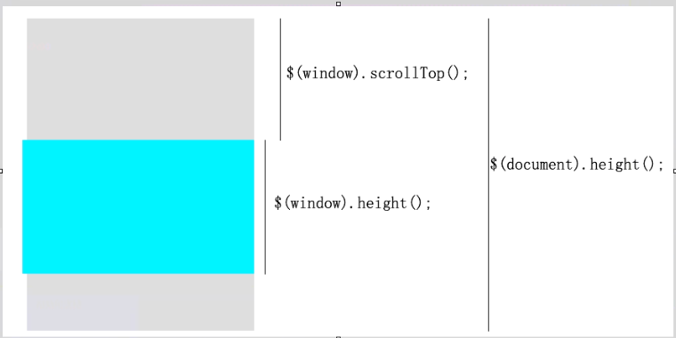

# 百度百家分析
* 关系分析
    * 
* 值的分析
    1. 页面的卷动值 `$(window).srcoll();`
        * document.body.scrollTop
    2. 窗口的高度 `$(window).height();`
        * document.body.ClientHeight
    3. 页面的总高度 `$(document).height()`
        * document.documentElement.ClientHeight
    4. show
        * document.body.clientWidth ==> BODY对象宽度
        * document.body.clientHeight ==> BODY对象高度
        * document.documentElement.clientWidth ==> 可见区域宽度
        * document.documentElement.clientHeight ==> 可见区域高度
* 比例的由来
    * 也就是说，页面的卷动值有一个范围 [0, $(document).height() - $(window).height()];
    * 也就是说, $(window).scrollTop() / $(document).height() - $(window).height() 一定是[0, 1]的一个区间
* 小知识
    * 当前页数，可以直接加，后台会处理
* 停止逻辑(瀑布流，滚到底加载更多dom的停止逻辑)(不在继续加载更多dom)
    ```
    // 使用一把锁来控制事件的触发
        var lock = true;
		$(window).scroll(function(){
			if(!lock) return;

			page++;
			getJSONRender(page);
			lock = false;
		})

		function getJSONRender(){
			$.get("url" + page, function(data){
				if(data.error) return;

				lock = true;
			})
		}
    ```
    
* 还有两个待解决的问题
    1. 小菊花
        * 最好的把一个元素放在padding区域里面
    2. footer
        * 在请求数据过程中，最好把footer隐藏，当没有数据可以显示的时候在显示footer

