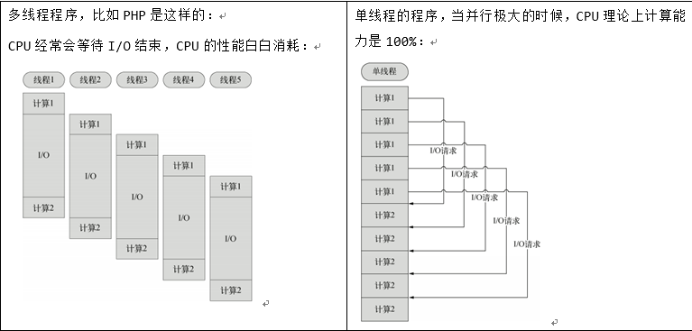
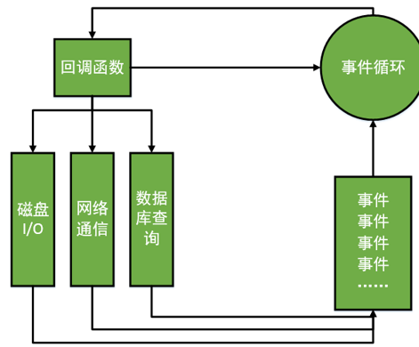
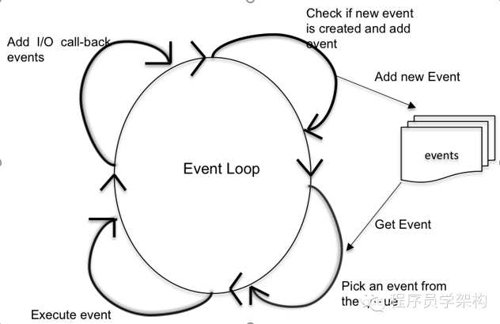

# 开发服务器程序
1. hello world
    * 我们写了一段程序02.js
        ```
        var http = require("http");

        // 创建一个服务器
        var server = http.createServer(function (req, res) {
            res.writeHead(200, {'Content-Type': "text/html; charset=utf-8"});
            res.end("<h1>我好开心呀，我买了一个iPhone" + (3 + 4) + "Plus, 我好开心! </h1>");
        });
        
        // 监听
        server.listen(30000, "127.0.0.1");
        ```
2. node程序执行流程
    * 
    * 查看源码，发现7是直接写上去的，并没有发现 3 + 4的代码，说明服务器node程序已经处理了逻辑，给浏览器返回了纯html文档
    * nodeJS 运行在服务端，而不是浏览器端，服务器计算了数字7之后，发给了浏览器就是扁平的，存粹的html
    * 小提示： 如果想要修改程序，刷新浏览器没用，必须打断服务器程序重新运行。(因为nodejs工作在后端服务器)
    
3. nodejs没有服务器结构
    * node.js是一个让JavaScript运行在服务器段的开发平台，他让JavaScript的触角伸到了服务器端。但是Node似乎和其他服务器端语言比如PHP，ASP，JSP有点不同
    * node.js不是一种独立的语言，与PHP，JSP，Python，Perl,Ruby的即是语言也是平台不同，Node.js的使用Javascript进行编程，(NodeJS是一个工具，语言仍然是JavaScript)运行在JavaScript引擎上(V8)
    * 与PHP，JSP等等相比，node.js跳过了Apache,Nginx，IIS等HTTP服务器，他自己不用建设在任何服务器。Node.js的许多设计理念与经典架构(LAMP)有着很大的不同，可以提供强大的伸缩能力。Node.js自身哲学是花最小的硬件成本，追求更高的并发，更高的处理性能。
 
4. 总结
    * 至此我们已经证明NodeJS运行在服务器端。我们使用JS开始开发服务器：GET请求的处理，POST请求参数的处理，数据库的增删改查， Cookie, session等等， 路由
    

## NodeJS特点
1. 单线程
    * 在Java，PHP或者.net等服务器端语言中，会为每一个客户端连接创建一个新的线程，而每个线程需要耗费大约2MB内存，也就是说，理论上一个8gb内存的服务器可以同时连接的最大用户数目位4000个左右，需要让Web应用程序同时支持更多的用户，就需要增加服务器的数量或者增加服务器的内存数，而Web应用程序的硬件成本当然就会上升。
    * Node.js不为每个客户连接创建一个新的线程，而仅仅会使用一个线程(Thread)。当有用户连接了，就触发一个内部事件，通过非阻塞I/O,事件驱动机制，让Node.js程序宏观上面看也是并行的，使用Node.js,一个8GB内存的服务器，可以同时处理超过4万用户的连接。
    * 单线程带来的好处，还有操作系统完全不再有线程的创建，销毁的时间开销
    * 一段程序证明NodeJS是单线程的
        * [单线程](file/02_node_是单线程的.js)
    * 另外一段程序
        * [file](file/03_可能会出现错误.js)
        * NodeJS中拥有JS的所有语言核心语法，甚至拥有所有ES2016的新语法(NodeJS目前不使用新语法，在React中使用webpack+babel编译ES2016),但是NodeJS没有所有BOM。比如window,和window的所有函数
        * 正是因为node是单线程的，此时唯一的node进程将会停止，此时会导致所有的访问者无法访问，
    
2. 异步I/O
    * [file](file/04_show_file.js)
    * 解释
        * 我们写了一个案例，来一个访问者就都去一个html文件，会发现当一个访问者访问服务器之后，此时这个人就会去读取文本文件，此时cpu并没有被阻塞，而是会服务其他人，当这个人的文本文件读取完毕之后，此时就会使用回掉函数来传递文本文件
        * 只要I/0越多，NodeJS宏观上越并行。
    * 但是如果node负责处理计算密集任务那？
        * [file](file/05_show_file.js)
        * 图解
            * 
        * 当增加了一段计算的时候，计算过程中cpu只能被某一个用户服务，难以脱身，所以node进程就被这一个用户霸占了
        * node.js适合于开发i/o多的业务，而不适合计算任务繁重的业务
    * 图解
        * 
        * 因为NodeJS想在破的机器上也能够高效运行，所以剑走偏锋采用了单线程的模式，既然单线程就必须异步I/O
    
3. 概念解析
    * 当在访问数据库取得数据的时候，需要一段较长的时间。在传统的处理机制中，在执行了访问数据库代码之后，整个线程都将暂停下来，等待数据库返回结果，才能执行后面的代码。也就是说，I/O阻塞了代码的执行，极大地降低了程序的执行效率。
    * 由于Node.js中采用了非阻塞型I/O机制，因此在执行了访问数据库的代码之后，将立即转而执行其后面的代码，把数据库返回结果的处理代码放在回调函数中，从而提高了程序的执行效率。
当某个I/O执行完毕时，将以事件的形式通知执行I/O操作的线程，线程执行这个事件的回调函数。 为了处理异步I/O，线程必须有事件循环，不断的检查有没有未处理的事件，依次予以处理。
    * 阻塞模式下，一个线程只能处理一项任务，要想提高吞吐量必须通过多线程。而非阻塞模式下，一个线程永远在执行计算操作，这个线程的CPU核心利用率永远是100%。所以，这是一种特别有哲理的解决方案：与其人多，但是好多人闲着；还不如一个人玩命，往死里干活儿。

  
## 事件驱动模型
* 在Node中，客户端请求建立连接，提交数据等等行为，会触发相应的事件，在Node中，在一个时刻只能执行一个事件回掉函数，但是在执行一个事件回掉函数的中途，可以转而处理其他事件(比如又有新的用户连接了)，然后返回继续执行原事件的回调函数，这种处理机制，称为"事件环"机制
* Node.js底层是C++(V8也是C++写的)。底层代码中，近半数都用于事件队列，回调函数队列的构建。用事件驱动来完成服务器的任务调度，
* 事件驱动
    * 
* 事件驱动是NodeJS的底层机制，我们需要了解NodeJS不会上错才的原因就是事件驱动，有一个事件环
    * 

## 应用场景
* Node.js适合什么样的应用程序那？
    * 当应用程序需要处理大量并发的I/O，而在向客户端发出响应之前，应用程序内部并不需要进行非常复杂的处理的时候，Node.js非常适合。Node.js也非常适合与web socket配合，开发长连接的实时交互应用程序。
    * 比如
        * 用户表单收集
        * 考试系统
        * 聊天室
        * 图文直播
        * 提供JSON的api(为前台的Angular使用)


## Node的缺点
* Node无法挑战php,jsp老牌编程语言
    * Node.js本是就是极客追求性能极致的产物，缺少了很多服务器的健壮考量。所以Node不可能应用在银行、证券、电信等需要极高可靠性的业务中。
    * 中国的企业实战中，创业型公司（正处于A轮、B轮）、有情怀的公司非常爱使用Node做核心业务：
        * 功夫熊的APP，后台是Node.js在伺服
        * 美团网订单处理，Node.js
        * 实现网，整站为Node.js搭建
    * 成熟大企业，基本上都是用Node实现某一方面的功能：
        * 知乎用了一个Node进程，跑起了“站内信”功能
        * 百度的很多表单，是用Node保存到数据库的
        * Node不是银弹，就是你工具箱中的一个小工具而已。

