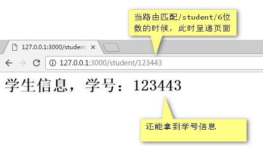

# 路由机制
1.  我们之前的案例中，不管我们访问的3000端口的什么网址，都能够得到同样的结果。如果我们要根据用户访问的网址给用户不同的显示，此时我们就需要使用req的url属性来进行判断。
    * [根据网址确定路由信息](file/01_路由演示.js)
    * 我们可以知道，req里面是用户的访问的请求信息，请求的网址当然是req了，res是服务器的响应信息。
    * 事实上，我们并不存在music文件夹,news文件夹，甚至我们能够伪装一个地址。
        ```
        if(req.url === "/"){
            res.end("首页");
        }else if(req.url === "/music.html"){
            res.end("音乐频道")
        }else if(req.url === "/news.html"){
            res.end("新闻频道");
        }
        ```
        * 也就是说Node.js是没有Apache的，是没有真实物理文件映射关系的。这叫做顶层路由设计，能够制作顶层路由设计的语言比较流行的仅仅有NodeJS和python
        
    * 甚至我们可以使用正则表达式去验证url是否匹配某一个模式，当然我们恶补一下正则：
        ```
        var str = "我今年12岁名你那13岁后年14岁，我就要买14个苹果";
        var reg = /(\d+)岁/g;
        var result;
        while(result = reg.exec(str)){
            console.log(result[1]);
        }
        ```
        * exec是最好用的正则方法        
    * 特别清晰的路由设计
        * 
        ```
        else if(/^\/student\/\d{6}$/.test(req.url)){
        var reg = /\/student\/(\d{6})/;
        var stuNum = reg.exec(req.url)[1];
        res.end("学生信息 学号为" + stuNum);
        }
        ```
        
2. 一个小的尝试
    * [学生管理路由](file/02_路由模拟学生管理系统.js)
    * 我们结合fs模块做一个小小的学生管理系统，顶层路由可以设计的非常漂亮，比如：
        * http://127.0.0.1:3000/student/100003
            * 就是检索100003号的学生的情况。比这种php的路由：
        * http://127.0.0.1:3000/student.php?xuehao=100003
            * 不知道高明到哪里去了。后面将知道，这种风格的路由叫做RESTful风格路由。
            
3. 我们将对于req.url的判断称之为路由表
    * res.end("") 表示结束输出流，让网页的小菊花停止转动
        * 每次请求必须遇到一个end()

        
        
        
        
        
            
        
        
        
        
        
        
        
        
        
        
        
        
        
        
        
        
        
        
        
        
        
        
        
        
        
        
        
        
        
        
        
        
        
        
        
        
        
        
        
        
        
        