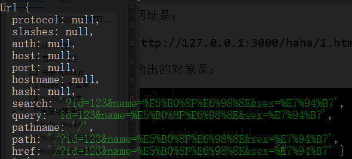
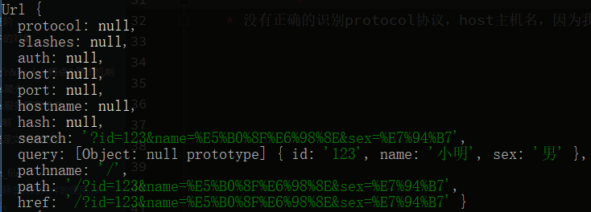
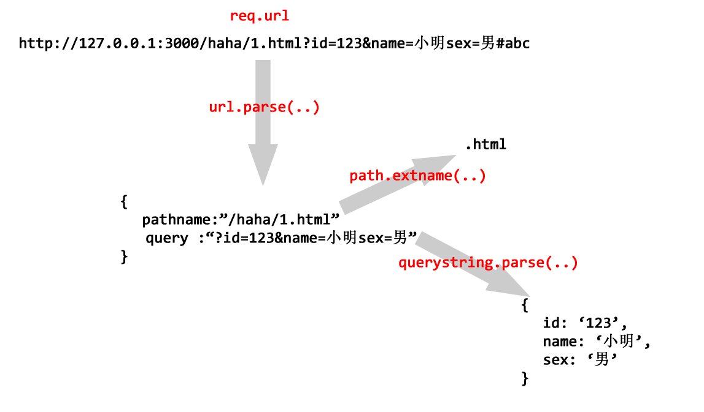

# 静态资源文件的使用
* 注意： 路由和真实的文件没有什么关系
* 我们现在不要进入Apache的世界中难以自拔，Apache是一个怎么样的世界？是一个物理文件和URL一一对应的世界
    * 在Apache中每一个文件的资源访问路径就是定的,例如`http://127.0.0.1/a/1.html`
    * 但是node没有根目录的概念，没有URL和物理文件一一对应的关系。
* 我们如果想要在html页面上，试图插入一个图片``此时这个0.jpg世纪的URL是`http://127.0.0.1/0.jpg`,所以必须给0.jpg做路由
    * 这个时候才能加载这个图片
    * 这样加载实在太费事了，我们需要一个静态文件资源管理器，那么我们需要url模块和path模块
    
## url模块，path模块，querystring模块
* 如果一个URl比较完整，包括querystring部分(就是GET请求查询字符串部分),hash部分：
    * `http://127.0.0.1:3000/b.html?id=123#123`
* 此时req.url是：
    * `/b.html?id=123`
* 也就是说,querystring属于req.url,但是hash不属于。
* 但是我们此时要得到文件名的部分，不想要querystring,此时可以使用正则提炼，但太麻烦。
* 此时node中提供了内置模块， url,path,querystring他们都可以服务于url的识别

### url模块
1. url.parse(urlString[,parseQueryString[, slashesDenoteHost]])
    * urlString 要解析的url字符串
    * parseQueryString <Boolean> 如果为true,则query属性总会通过querystring模块的parse()方法生成一个对象，如果为false，则返回的url对象上的query属性会是一个未解析，未解码的字符串，默认为false
    * slashesDenoteHost 如果未true,则//之后至下一个/之前的字符串会被解析作为host,例如 //foo/bar会被解析为{host: 'foo', pathname: '/bar'}，而不是{pathname: '//foo/bar'}默认未false
    * url.parse()方法会解析一个URL字符串并返回一个URL对象
    
2. 例子
    * 例如网址为http://localhost:30000/?id=123&name=%E5%B0%8F%E6%98%8E&sex=%E7%94%B7#aaa
    * 输出
        * 
        * 加一个true之后的输出
            * 
    * 没有正确的识别protocol协议，host主机名，因为我们是Windows环境，确实有这个问题
    * 如果加上ulr.parse(req.url,true),此时querystring部分将会自动变成一个对象，方便我们存入数据库
        
2. path模块
    1. path.dirname(path)
        * 路径名
    2. path.extname(path)
        * 拓展名
    
3. querystring
    * 和url模块加true差不多
    * querystring.parse(),就是将url对象的query部分封装为对象
    
4. 图解
    * 
      