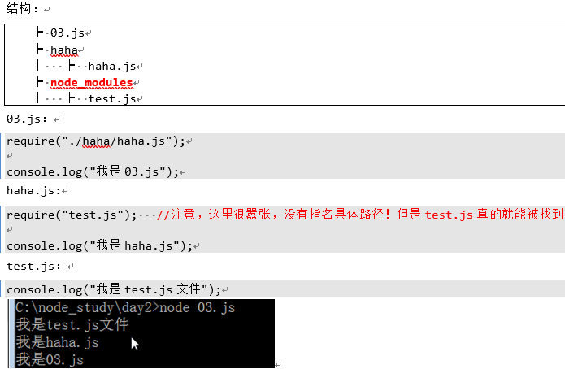

# 神奇的node_modules文件夹
* 如果我们写一个引用，没有写./: `require("test.js");`，此时表示引用node_modules文件夹中的东西
    * 换句话说，当你引用node_modules文件夹中的内容的时候，就不需要写./了
    * 并且更为神奇的是，node_modules文件夹里面的模块，在引用的使用不需要考虑路径，你只需要确保node_modules文件夹在需要引用的js文件的路径的任何祖先路径中。
        * 
        * 不仅如此，比如我们现在haha.js文件，它不是要引入test.js么？此时node_modules文件夹出现在任何haha.js的祖先目录中都可以。
        * 下面四个目录中出现了node_modules文件夹，此时将自动识别test.js文件：
            * C:\node_study\day2\haha
            * C:\node_study\day2\
            * C:\node_study\
            * C:\
* 有一个路径更加神奇，叫做系统环境路径，在`C:\users\你的电脑名字\AppData\Roaming`，这个文件夹中放入的模块，将在整个文件夹中被识别，这个路径是全局路径
* 当你省略文件名的时候，会自动识别index.js文件
    * 例如
        ```
        ┝ 03.js
        ┝ haha
        │   ┝  haha.js
        ┝ node_modules
        │   ┝  test
        │   │   ┝   index.js
        ```
        * 03.js
            ```
            require("./haha/haha.js");
            console.log("我是03.js")
            ```
        * haha.js
            ```
            require("test");     /实际引入的是node_modules文件夹中的test文件夹中的index.js
            ```
        * index.js
            * `console.log('我是index.js')`

* 一道例题
    ```
    下列的四种require写法，实际引入的是谁：
    require("./a.js")    // 引入当前目录下的a.js
    require("a.js")      // 引入node_modules目录下的a.js
    require("a")         // 引入node_modules目录下的a文件夹下的index.js
    require("./a")       // 引入当前目录的a文件夹下的index.js

    ```


        