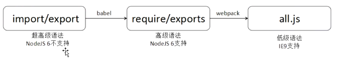

# ES6中的import from和export
* es6自带了CMD规则的语句，实际上增加了我们的困扰
    * 语句不是require, exports, module几个词语，而是import, export
* 所以，流程是
    * import/export -->(babel) require/exports -->(webpack) all.js
* 图解
    * 
* 比如我们创建一个app文件夹，放入main.js和a.js两个文件。
    * `/app/main.js`
        * `import {sum, pingfang, sancifang} from "a.js"`// 引包并自动解构
    * `/app/a.js`
        ```
        let sum = (a, b) =>{
            return a + b;
        }
        let pingfang = (a) => {
            return a * a;
        }
        export {sum, pingfang};
        // 用export暴露一个json，这个json是kv一致的，所以可以省略v
        ```
    * 然后使用babel翻译整个文件夹
        * `babel app --out-dir dist`
    * 然后得到翻译后的文件    
        得到翻译后的文件：
        ```
            dist/main.js：
            "use strict";
            
            var _a = require("a.js");   //翻译成为require了
            
            console.log((0, _a.sum)(3, 4));
            console.log((0, _a.pingfang)(3));
            console.log((0, _a.sancifang)(3));
            
            dist/a.js
            "use strict";
            
            Object.defineProperty(exports, "__esModule", {
                value: true
            });
            var sum = function sum(a, b) {
                return a + b;
            };
            
            var pingfang = function pingfang(a) {
                return a * a;
            };
            
            var sancifang = function sancifang(a) {
                return a * a * a;
            };
            
            exports.sum = sum;   				//都变为了exports
            exports.pingfang = pingfang; 		//都变为了exports
            exports.sancifang = sancifang;      //都变为了exports
        ```
## 暴露一个东西
* 如果指向向外暴露一个东西，比如构造函数，类似我们的module.exports,此时ES6中的
    ```
    class People{
        constructor(name){
            this.name = name;
        }
        haha(){
            console.log(`我是${this.name}`);
        }
    }
    export default People;
    ```
    * 引包时可以不需要结构，直接引入
* 注意
    * ES6中的export完全和之前的exports.** = ** 不一样, 标准CMD中exports可以暴露很多东西
        ```
        exports.showIndex = function(){
        }
        exports.doPost = function(){
        }
        // 引入
        var mainCtrl = require("./controller/mainctrl.js");
        mainCtrl.showIndex();
        ```
    * 但是ES6中的export语法只能暴露一个东西，只能暴露JSON。如果只暴露一个东西（通常是构造函数）就要用export default。
        * 能够重新起名字: `import {lastName as name} from './profile'`
